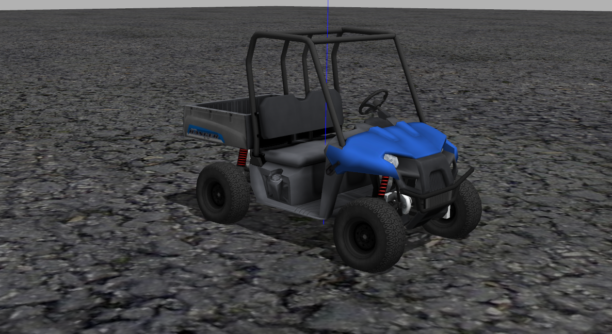

# OSCAR


<p float="left">
  
   
</p>

## Introduction

Access the OSCAR main page to understand the OSCAR architecture and its importance on research and education in autonomous vehicles. The OSCAR_px4 page focus on backend system, the rover is PX4 Autopilot with Robotic Operating System (ROS) communicating with PX4 running on hardware. For more information on replicating the hardware setup, settings and parameters read the px_4 documentation.    


## Download the OSCAR_px4 Source Code

```
$ git clone https://github.com/jomidokunMain/OSCAR_px4.git  --recursive
```

## Directory Structure
- `catkin_ws`: ros workspace
  - `src`
    - `data_collection`: data from front camera and steering/throttle
    - `rover`: 
- `config`: configurations
  - `conda`: conda environment files
  - `config.yaml`: config file names for neural_net, data_collection, and run_neural
  - `neural_net`: system settings for neural_net
  - `data_collection`: system settings for data_collection
  - `run_neural`: system settings for run_neural
- `neural_net`: neural network package for end to end learning
- `PX4-Autopilot`: The folder for the PX4 Autopilot.

## Prior to Use

### Versions 

The OSCAR has been tested with ROS Melodic on Ubuntu 18.04.

### Install ROS packages
Install two more packages for this project unless you already have them in your system.
```
$ sudo apt install ros-$ROS_DISTRO-fake-localization
$ sudo apt install ros-$ROS_DISTRO-joy

```

### Create Conda Environment 

Create a conda environment using an environment file that is prepared at `config/conda`.
```
$ conda env create --file config/conda/environment.yaml
```
### rover only
This section applies to `rover` which is based on `PX4 `. When RC signal is lost, the vehicle's default behavior is `homing` with `disarming` to protect the vehicle. 
We disabled this feature to prevent the vehicle from disarming whenever control signals are not being sent.

Use QGroundControl to disable the feature. Find `COM_OBLACT` and make it `Disable`.

## How to Use


1. Activate the `oscar` environment. 
```
$ conda activate oscar
```
2. Locate the OSCAR_px4 files
```
$ cd OSCAR_px4
```
3. Source the bash setup
```
$ source ./setup.bash
```

4. Start the rover make sure that the px4 and camera are porperly connected to the computer

```
(oscar) $ ./start_rover.sh
```

5. Get rover ready to be controlled.

Open a new terminal and run the following shell scripts.
```
(oscar) $ ./cmd_arming.sh
(oscar) $ ./offboard_mode.sh
```

Then the `rover` is ready to be controlled by the topic `/mavros/setpoint_velocity/cmd_vel` or `/mavros/setpoint_velocity/cmd_vel_unstamped`. The `OSCAR` uses the `unstamped` version.

## How to Collect Data

Run the script with a data ID as an argument.
```
(oscar) $ ./collect_data_fusion jaerock
```

The default data folder location is `$(pwd)e2e_data`.

### Data Format

From `data_collection` config version 0.92, the CSV file has one more column for `brake`. Use `convert_csv.py` to convert a data CSV file collected before 0.92 to a new CSV file.

Collection will save a csv file with images. The CSV file has following columns

```
image_file_name / steering_angle / throttle / brake / linux_time / velocity / velocity_x / velocity_y / velocity_z / position_x / position_y / position_z

```

```
2020-12-08-23-55-31-150079.jpg	-0.0149267930537	0.15	1607489731.15	0.846993743317	0.846750728334	-0.00903874268025	-0.0181633261171	8.25840907119	-102.836707258	0.0248406100056

```


## Acknowledgments

### System Design and Implementation

- Jaerock Kwon, Ph.D.: Assistant Professor of Electrical and Computer Engineering at the University of Michigan-Dearborn
- Jesudara Omidokun, Msc: Electrical Engineering Student at University of Michigan-Dearborn

### Implementation


### References

- https://github.com/osrf/car_demo
- https://github.com/ICSL-hanyang/uv_base/tree/Go-kart
- https://github.com/PX4/PX4-Autopilot